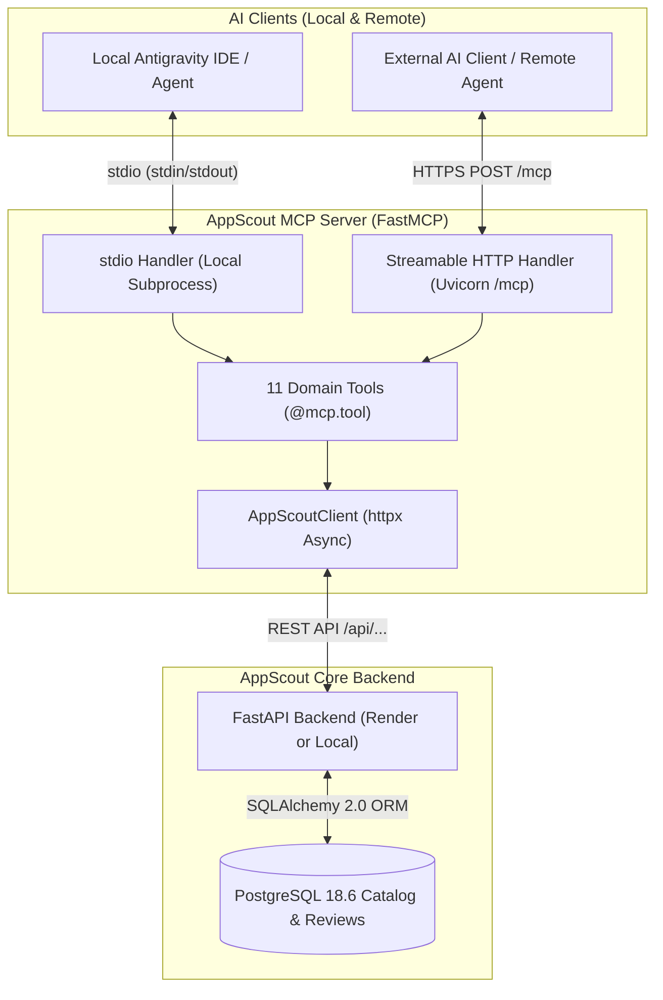

# Model Context Protocol (MCP) Server Architecture

This document specifies the architecture, tool specifications, execution parameters, deployment topology, and client integration guides for the **AppScout Model Context Protocol (MCP) Server**.

---

## 1. System Topology & Design Principles

The AppScout MCP server acts as an AI interface layer between LLM clients (such as **Google Antigravity**, Claude Desktop, or custom agent runners) and the AppScout market intelligence platform. It exposes verified Shopify marketplace data over the open **Model Context Protocol (MCP)** supporting dual transports:

1. **Local Mode (`stdio`)**: Spawns a local subprocess communicating over standard input/output JSON-RPC.
2. **Remote Mode (`streamable-http`)**: Operates as a cloud-hosted web service over HTTPS with Streamable HTTP session framing and DNS rebinding protection.



### Client vs. Server: Understanding the Difference
* **MCP Server (`mcp_server`)**: The service that implements and hosts the tools, receives requests, executes business logic via the FastAPI backend, and returns structured data.
* **MCP Client (e.g. Antigravity IDE, Claude, external scripts)**: The AI interface or application that connects to the server, queries the available tool definitions, prompts the model to generate tool calls, and sends the call payloads to the server.

### Core Architecture Guarantees
1. **Single Source of Truth**: The MCP server has **no direct database connection**. Every query is proxied asynchronously via `httpx` to the FastAPI backend (`APPSCOUT_API_BASE_URL`), preserving identical route validations, business logic, and Pydantic schemas.
2. **Zero Mock or Replacement Data**: Every metric, rating distribution, and review returned to the agent originates from real PostgreSQL tables.
3. **Strict Stream Isolation (Local Mode)**: All logging routes strictly to `sys.stderr`. Standard output (`sys.stdout`) is reserved exclusively for JSON-RPC message framing, preventing protocol deserialization crashes.
4. **Token Economy**: Parameter bounds and default pagination limits (`limit=10`, max `50` or `100`) prevent unbounded payloads from exhausting the model's context window.

---

## 2. Specification of the 11 MCP Tools

The server exposes **11 domain tools** covering the entire Shopify App Store market intelligence lifecycle:

| # | Tool Name | Mapped REST Endpoint | Primary Purpose | Key Parameters |
|:---:|---|---|---|---|
| 1 | `check_backend_health` | `GET /api/health` | Diagnostic check of backend and PostgreSQL connectivity | *None* |
| 2 | `get_market_overview` | `GET /api/overview` | Macro KPIs: 21.5k apps, 738k reviews, pricing & star distributions | *None* |
| 3 | `search_apps` | `GET /api/apps` | Multi-facet app filtering (keyword, category, rating, reviews, pricing) | `q`, `category`, `pricing_type`, `min_rating`, `min_reviews`, `sort_by`, `limit` |
| 4 | `get_app_details` | `GET /api/apps/{slug_or_id}` | 360-degree app profile, pricing plan tiers, and recent merchant reviews | `slug_or_id` (required) |
| 5 | `get_categories` | `GET /api/categories` | Browse 166 taxonomy categories with app volume and mean ratings | `q`, `sort_by`, `sort_order`, `page`, `limit` |
| 6 | `get_category_intelligence` | `GET /api/categories/{slug_or_id}` | Deep category niche analysis and competitive cohorts (Most-Reviewed, Highest-Rated, Lowest-Rated) | `slug_or_id` (required), `ranking_limit` (default: 10) |
| 7 | `get_pricing_overview` | `GET /api/pricing/overview` | Pricing intelligence across 42.3k plan tiers: median price ($21), billing intervals, trial rates | *None* |
| 8 | `search_pricing_plans` | `GET /api/pricing/plans` | Search and filter discrete plan tiers by features, price range, and interval | `q`, `app_slug`, `billing_interval`, `min_price`, `max_price`, `limit` |
| 9 | `search_reviews` | `GET /api/reviews` | Search and inspect 738k verified reviews by sentiment, rating, and keywords | `q`, `app_slug`, `rating` (1-5), `sort_by`, `limit` |
| 10 | `get_review_stats` | `GET /api/reviews/stats` | Global review telemetry and star breakdown distribution (1 to 5 stars) | *None* |
| 11 | `get_data_coverage` | `GET /api/coverage` | Data pipeline reconciliation accounting, field fill rates, and integrity checks | *None* |

---

## 3. Deployment Topology & Configuration

The codebase dynamically supports both local `stdio` execution and remote cloud hosting via environment variables.

### Environment Variables

| Variable | Default | Purpose & Description |
|---|---|---|
| `MCP_TRANSPORT` | `stdio` | Transport protocol: `"stdio"` for local subprocess, `"streamable-http"` (or `"sse"`) for remote hosting. |
| `MCP_HOST` | `127.0.0.1` (local) / `0.0.0.0` (HTTP) | Network interface for the server to bind. Automatically defaults to `0.0.0.0` when running in HTTP mode. |
| `MCP_PORT` / `PORT` | `8000` | Port for HTTP listening. On cloud platforms like Render, Render injects `PORT`, which automatically takes precedence. |
| `APPSCOUT_API_BASE_URL` | `http://127.0.0.1:8000` | Base URL of the target AppScout FastAPI backend. |
| `MCP_ALLOWED_HOSTS` | `""` | Comma-separated list of allowed hostnames for DNS rebinding protection behind reverse proxies. |
| `APPSCOUT_REQUEST_TIMEOUT` | `30.0` | Timeout in seconds for backend HTTP calls. |

> [!IMPORTANT]
> **Formatting `MCP_ALLOWED_HOSTS`**:
> Provide the **hostname only**, without protocol or paths (e.g. `appscout-mcp.onrender.com`, NOT `https://appscout-mcp.onrender.com/mcp`). Setting this variable expands both exact domain and port-wildcard matches to accept forwarded HTTPS headers from cloud reverse proxies.

---

## 4. Deployed Remote Service

The AppScout MCP server is deployed remotely on Render:
* **Remote MCP Endpoint**: `https://appscout-mcp.onrender.com/mcp`
* **Production Backend**: `https://appscout-backend.onrender.com`

### Connecting an External AI Client (No Repository Clone Needed)
External developers and AI clients do **not** need to clone the repository or install Python dependencies locally to use the AppScout MCP server. Any MCP-compatible client can connect directly to the hosted endpoint:

```json
{
  "mcpServers": {
    "appscout-remote": {
      "serverUrl": "https://appscout-mcp.onrender.com/mcp"
    }
  }
}
```

### When is Cloning Useful?
Cloning the repository (`git clone ...`) is only needed if you wish to:
1. Run or develop the AppScout FastAPI backend and data scrapers locally.
2. Run the local `stdio` MCP server with custom modifications.
3. Execute the automated test suites or contribute to the codebase.

---

## 5. Local Antigravity Dual Configuration

The workspace provides local configuration files ([`mcp_config.json`](file:///c:/Sanjana/Spryntworks/Projects/AppScout/mcp_config.json) and [`.agents/plugins/appscout/mcp_config.json`](file:///c:/Sanjana/Spryntworks/Projects/AppScout/.agents/plugins/appscout/mcp_config.json)) configured to support both local development and remote testing side-by-side:

```json
{
  "mcpServers": {
    "appscout": {
      "command": ".venv/Scripts/python.exe",
      "args": ["-m", "mcp_server.server"],
      "env": {
        "APPSCOUT_API_BASE_URL": "http://127.0.0.1:8000"
      }
    },
    "appscout-remote": {
      "serverUrl": "https://appscout-mcp.onrender.com/mcp"
    }
  }
}
```

---

## 6. Verified Testing Results

Both transports have undergone live end-to-end verification against real database records:

1. **Local `stdio` Transport**:
   - `tests/test_mcp_server.py`: Passed 100% (schemas, stderr logging isolation, error translations).
   - `tests/test_live_mcp_integration.py`: Passed all 14 integration steps over stdio client sessions.
   - Parity confirmed with local PostgreSQL database.
2. **Remote `streamable-http` Transport**:
   - Tested using independent Python client sessions connecting directly over HTTPS to `https://appscout-mcp.onrender.com/mcp`.
   - **Initialization**: Successful handshake (`AppScout v1.30.0`).
   - **Tool Discovery**: All 11 tools discovered.
   - **Tool Execution**: Tested all 11 tools live against the remote Render backend (`https://appscout-backend.onrender.com`), successfully querying 21,502 apps, 738,101 reviews, category cohorts, and pricing tiers.

---

## 7. Troubleshooting Common Issues

### 1. Root URL Returns `404 Not Found` in Browser
* **Symptom**: Opening `https://appscout-mcp.onrender.com/` in a web browser displays `{"detail":"Not Found"}`.
* **Explanation**: The MCP server does not host a human-facing web page at the root `/`. The MCP protocol endpoint is mounted at `/mcp`.

### 2. Direct Browser Request to `/mcp` Returns `406 Not Acceptable`
* **Symptom**: Navigating to `https://appscout-mcp.onrender.com/mcp` directly in a browser returns `406 Not Acceptable`.
* **Explanation**: Streamable HTTP requires MCP-specific HTTP request headers (`Accept: application/json, text/event-stream` and `Content-Type: application/json`). Standard web browser GET requests without these headers are rejected by FastMCP.

### 3. `421 Misdirected Request` / `Invalid Host header`
* **Symptom**: Client connections are rejected with `HTTP 421 Misdirected Request` and body `Invalid Host header`.
* **Explanation**: FastMCP includes DNS rebinding protection that validates incoming `Host` headers. When deployed behind a reverse proxy (such as Render or Cloudflare), the incoming request Host is `appscout-mcp.onrender.com`.
* **Fix**: In Render's Dashboard, set the environment variable:
  ```bash
  MCP_ALLOWED_HOSTS=appscout-mcp.onrender.com
  ```
  *(Remember: host name only; omit `https://` and path).*

### 4. Render Service Cold Starts / Timeouts
* **Symptom**: Initial connection to Render takes 30–50 seconds or times out on free-tier instances.
* **Explanation**: Render free-tier web services spin down after 15 minutes of inactivity. Both `appscout-mcp` and `appscout-backend` may need ~45 seconds to spin up on the first request.
* **Fix**: Ensure client request timeouts are set to at least 30–60 seconds, or ping `/api/health` on the backend and `/mcp` on the MCP service to warm them up.

