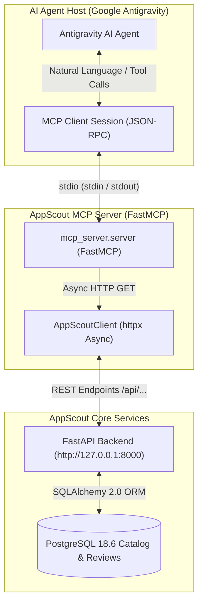

# Model Context Protocol (MCP) Server Architecture

This document specifies the architecture, tool specifications, execution parameters, and agent integration topology for the **AppScout Model Context Protocol (MCP) Server**.

---

## 1. System Topology & Design Principles

The AppScout MCP server acts as an AI interface layer between LLM agents (such as **Google Antigravity**) and the AppScout market intelligence platform. It exposes verified Shopify marketplace data over the open **Model Context Protocol (MCP)** using standard `stdio` JSON-RPC framing.



### Core Architecture Guarantees

1. **Single Source of Truth**: The MCP server contains **zero direct database access**. All queries are proxied via asynchronous HTTP requests (`httpx`) to the existing FastAPI backend (`http://127.0.0.1:8000`), preserving identical route validations, business logic, and Pydantic schemas.
2. **Zero Mock or Replacement Data**: Every metric, rating breakdown, and review returned to the agent originates from real PostgreSQL tables.
3. **Strict Stream Isolation**: All diagnostics, audit traces, and error logging are routed strictly to `sys.stderr`. Standard output (`sys.stdout`) is reserved exclusively for JSON-RPC message framing, preventing protocol deserialization crashes.
4. **Token Economy**: Parameter bounds and default pagination limits (`limit=10`, max `50` or `100`) prevent unbounded payloads from exhausting the agent's context window.

---

## 2. Specification of the 11 MCP Tools

The MCP server registers **11 domain tools** covering the entire Shopify App Store market intelligence lifecycle:

| # | Tool Name | Mapped REST Endpoint | Primary Purpose | Key Parameters |
|:---:|---|---|---|---|
| 1 | `check_backend_health` | `GET /api/health` | Diagnostic check of backend and PostgreSQL connectivity | *None* |
| 2 | `get_market_overview` | `GET /api/overview` | Macro KPIs: 21.5k apps, 738k reviews, pricing & star distributions | *None* |
| 3 | `search_apps` | `GET /api/apps` | Search and filter apps by keyword, category, rating, pricing, and reviews | `q`, `category`, `pricing_type`, `min_rating`, `min_reviews`, `sort_by`, `limit` |
| 4 | `get_app_details` | `GET /api/apps/{slug_or_id}` | 360-degree app profile, pricing plan tiers, and recent merchant reviews | `slug_or_id` (required) |
| 5 | `get_categories` | `GET /api/categories` | Browse all 166 taxonomy categories with app density and mean ratings | `q`, `sort_by`, `sort_order`, `page`, `limit` |
| 6 | `get_category_intelligence` | `GET /api/categories/{slug_or_id}` | Deep category niche analysis and competitive cohorts (Most-Reviewed, Highest-Rated, Lowest-Rated) | `slug_or_id` (required), `ranking_limit` (default: 10) |
| 7 | `get_pricing_overview` | `GET /api/pricing/overview` | Pricing intelligence across 42.3k plan tiers: median price ($21), billing intervals, trial rates | *None* |
| 8 | `search_pricing_plans` | `GET /api/pricing/plans` | Search and filter discrete plan tiers by features, price range, and interval | `q`, `app_slug`, `billing_interval`, `min_price`, `max_price`, `limit` |
| 9 | `search_reviews` | `GET /api/reviews` | Search and inspect 738k verified reviews by sentiment, rating, and keywords | `q`, `app_slug`, `rating` (1-5), `sort_by`, `limit` |
| 10 | `get_review_stats` | `GET /api/reviews/stats` | Global review telemetry and star breakdown distribution (1 to 5 stars) | *None* |
| 11 | `get_data_coverage` | `GET /api/coverage` | Data pipeline reconciliation accounting, field fill rates, and integrity checks | *None* |

---

## 3. Server Configuration & Execution

### Prerequisites
* Python `3.12+` with dependencies installed from `requirements.txt`:
  * `mcp>=1.3.0,<2`
  * `httpx>=0.27.0`
* Active AppScout FastAPI backend running on `http://127.0.0.1:8000`.

### Environment Variables
Configure via environment or `.env` file:

| Variable | Default | Description |
|---|---|---|
| `APPSCOUT_API_BASE_URL` | `http://127.0.0.1:8000` | Target URL of the AppScout FastAPI service |
| `APPSCOUT_REQUEST_TIMEOUT` | `30.0` | Timeout in seconds for backend HTTP calls |
| `PYTHONUNBUFFERED` | `1` | Ensures immediate stdout/stderr flushing |

### Starting the Server Manually
To start the FastMCP server over standard input/output:

```bash
# Windows
.venv\Scripts\python -m mcp_server.server

# Linux / macOS
.venv/bin/python -m mcp_server.server
```

---

## 4. Antigravity Agent Integration

Antigravity connects to the AppScout MCP server automatically using workspace customization discovery.

### Configuration (`mcp_config.json`)
The project provides two configuration locations:
1. **Repository Root** (`mcp_config.json`): Standard discovery for IDEs and general MCP hosts.
2. **Workspace Plugin** (`.agents/plugins/appscout/mcp_config.json`): Packaged Antigravity plugin entrypoint.

#### Configuration Snippet
```json
{
  "mcpServers": {
    "appscout": {
      "command": ".venv/Scripts/python.exe",
      "args": ["-m", "mcp_server.server"],
      "env": {
        "APPSCOUT_API_BASE_URL": "http://127.0.0.1:8000"
      }
    }
  }
}
```

> **Cross-Platform Note**: On Linux or macOS environments, change `"command"` to `".venv/bin/python"`.

---

## 5. Example Natural Language Inquiries

When paired with Antigravity, the AI agent can autonomously resolve complex marketplace questions:

* **Ecosystem Sizing**:
  * *User*: *"What is the overall size of the Shopify app ecosystem?"*
  * *Tool Call*: `get_market_overview()`
  * *Result*: 21,502 canonical apps, 738,101 reviews, 166 categories, 4.74 average rating.
* **Category Dominance**:
  * *User*: *"Which are the largest app categories?"*
  * *Tool Call*: `get_categories(sort_by="app_count", limit=10)`
  * *Result*: Store management operations analytics (1,327 apps), Analytics (1,081 apps), SEO (790 apps).
* **High-Proof Application Discovery**:
  * *User*: *"Find highly rated apps with more than 1,000 reviews."*
  * *Tool Call*: `search_apps(min_rating=4.5, min_reviews=1000, sort_by="reviews", limit=10)`
  * *Result*: Returns 135 matching apps, led by Judge.me (44,288 reviews, 5.0), TikTok (15,468 reviews, 4.8), and Shopify Flow (12,377 reviews, 4.7).
* **Commercial Model Breakdown**:
  * *User*: *"What pricing models are most common across Shopify apps?"*
  * *Tool Call*: `get_pricing_overview()`
  * *Result*: Paid (37.1%), Freemium (36.2%), Free (8.7%), with a median plan price of $21.00/month.
* **Deep App Intelligence**:
  * *User*: *"Show me the details of Judge.me."*
  * *Tool Call*: `get_app_details(slug_or_id="judgeme")`
  * *Result*: Complete profile, Forever Free vs Awesome ($15/mo) plans, and analyzed review excerpts.

---

## 6. ChatGPT Integration Status

> [!NOTE]
> **ChatGPT Connection Status: Not Configured Yet**
> 
> The current AppScout MCP server implementation is purpose-built for **Google Antigravity** and local agent runners that support process-based `stdio` JSON-RPC transport.
> 
> Connecting OpenAI ChatGPT (via Custom GPTs or ChatGPT Actions) requires:
> 1. An externally accessible HTTPS domain with a valid TLS certificate.
> 2. An SSE (Server-Sent Events) or REST OpenAPI schema gateway.
> 3. OAuth / API key authentication infrastructure.
> 
> Supporting ChatGPT Actions is slated for a future release.
