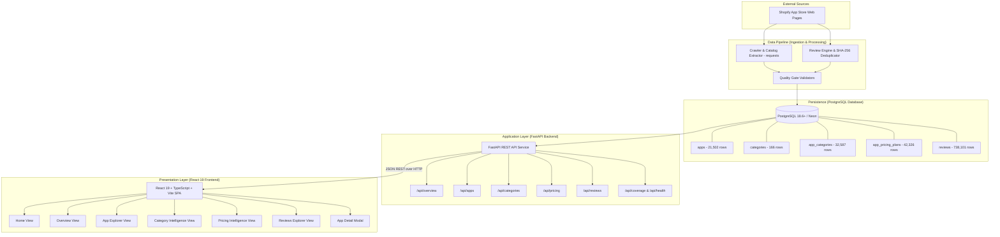

# AppScout System Architecture

This document outlines the technical architecture, component interactions, and end-to-end data flow of the AppScout platform.

---

## 1. System Overview

AppScout is structured as a decoupled full-stack monorepo consisting of:
* **Presentation Layer**: A modern Single Page Application (SPA) built with React 19, TypeScript, and Vite.
* **Application Layer**: An asynchronous REST API service built with FastAPI and SQLAlchemy 2.0.
* **Persistence Layer**: A relational PostgreSQL database (tested on PostgreSQL 18.6+ and compatible with serverless Neon Cloud).
* **Data Pipeline**: A Python-based crawling, extraction, validation, and ingestion engine that collects and normalizes catalog and review data from the public Shopify App Store.



---

## 2. Major Components & Responsibilities

### 2.1 Frontend Client (Single Page Application)
* **Framework**: React 19 with TypeScript, bundled by Vite 8.
* **Styling**: Tailwind CSS utility tokens paired with clean, accessible component styling.
* **HTTP Client**: Native browser `fetch()` API wrapped in a strongly typed client (`frontend/src/api/client.ts`).
* **Responsibilities**:
  * Renders 6 primary views: Home, Market Overview, App Explorer, App Categories, App Pricing, and App Reviews.
  * Manages client-side navigation, debounce-controlled searches, multi-facet category/pricing filters, and pagination.
  * Hosts a shared, global `AppDetailModal` displaying full application profiles, structured plan tiers, and merchant review excerpts with transparent three-state review coverage notices (Cases A, B, and C).
  * Enforces loading-state priorities (`loading` $\to$ `error` $\to$ `data` $\to$ `empty`) to prevent layout shifts.

### 2.2 Backend Application (FastAPI REST API)
* **Framework**: FastAPI on Python 3.12+ served by Uvicorn ASGI server.
* **ORM & Serialization**: SQLAlchemy 2.0+ (using declarative models and modern `select()` syntax) and Pydantic v2 schemas.
* **Responsibilities**:
  * Exposes 14 normalized REST endpoints organized into 6 domain routers under `/api`.
  * Computes market aggregations, statistical review evidence distributions, and ranked cohorts.
  * Manages database sessions safely via FastAPI dependencies (`get_db_session`), connection pooling, parameter validation, and pagination bounds.
  * Configures Cross-Origin Resource Sharing (CORS) middleware to allow seamless local development and production origin management.

### 2.3 Relational Persistence Layer (PostgreSQL)
* **Engine**: PostgreSQL 18.6+ (tested locally and verified on Neon Cloud serverless PostgreSQL).
* **Responsibilities**:
  * Stores 21,502 canonical applications, 166 taxonomy categories, 32,587 category relationships, 42,326 structured pricing tiers, and 738,101 merchant reviews.
  * Enforces relational integrity, foreign key cascades, and unique constraints.
  * Backed by B-tree indexes on slugs, star ratings, review dates, and review fingerprints to maintain sub-100ms response times.

### 2.4 Data Pipeline & Review Engine
* **Technology**: Python scripts in `experiment/` utilizing `requests`, `beautifulsoup4`, regex parsing, and multi-threaded worker pools.
* **Responsibilities**:
  * Crawls public Shopify directory leaf categories and sitemaps.
  * Extracts structured JSON-LD schemas and server-rendered HTML cards.
  * Computes deterministic SHA-256 fingerprints to guarantee idempotent review deduplication.
  * Enforces exponential backoff and polite delay intervals to respect server rate limits.

---

## 3. End-to-End Data Flow

```text
1. Data Acquisition & Validation
   Shopify Web Pages ──> Requests Fetcher ──> Parser & Extractor ──> Validation Gates ──> PostgreSQL

2. API Query & Serialization
   Client Request ──> FastAPI Router ──> SQLAlchemy 2.0 Query ──> Pydantic v2 Model ──> JSON Response

3. Client Rendering & Interaction
   JSON Response ──> Native Fetch Client ──> React View State ──> Virtual DOM Diffing ──> Browser DOM
```

1. **Acquisition**: Crawlers request public Shopify category listings and app detail pages over HTTP/HTTPS.
2. **Extraction & Validation**: Server-rendered HTML is parsed using BeautifulSoup4 and regex. Data passes through strict Pydantic/SQLAlchemy validation gates.
3. **Storage**: Sanitized records are written into normalized relational tables (`apps`, `categories`, `app_categories`, `app_pricing_plans`, `reviews`).
4. **API Consumption**: The frontend triggers asynchronous typed `fetch()` requests against `/api` routes (proxied in development by Vite to `127.0.0.1:8000`).
5. **UI Rendering**: The React client consumes structured payloads, applies UI formatting utilities, and renders data with loading states and error boundaries.

---

## 4. External Services & Dependencies

| Dependency | Purpose | Mode of Interaction |
| :--- | :--- | :--- |
| **Shopify App Store** (`apps.shopify.com`) | Origin data source for catalog, pricing tiers, and merchant reviews | Public HTTP/HTTPS GET requests |
| **PostgreSQL Database** | Persistent relational data store | TCP connection via SQLAlchemy 2.0 & `psycopg` |
| **Uvicorn ASGI Server** | Asynchronous HTTP web server for FastAPI | Direct HTTP listener / reverse proxy |
| **Vite Dev / Build Engine** | Frontend module bundling, asset hashing, and minification | Node.js runtime CLI |
