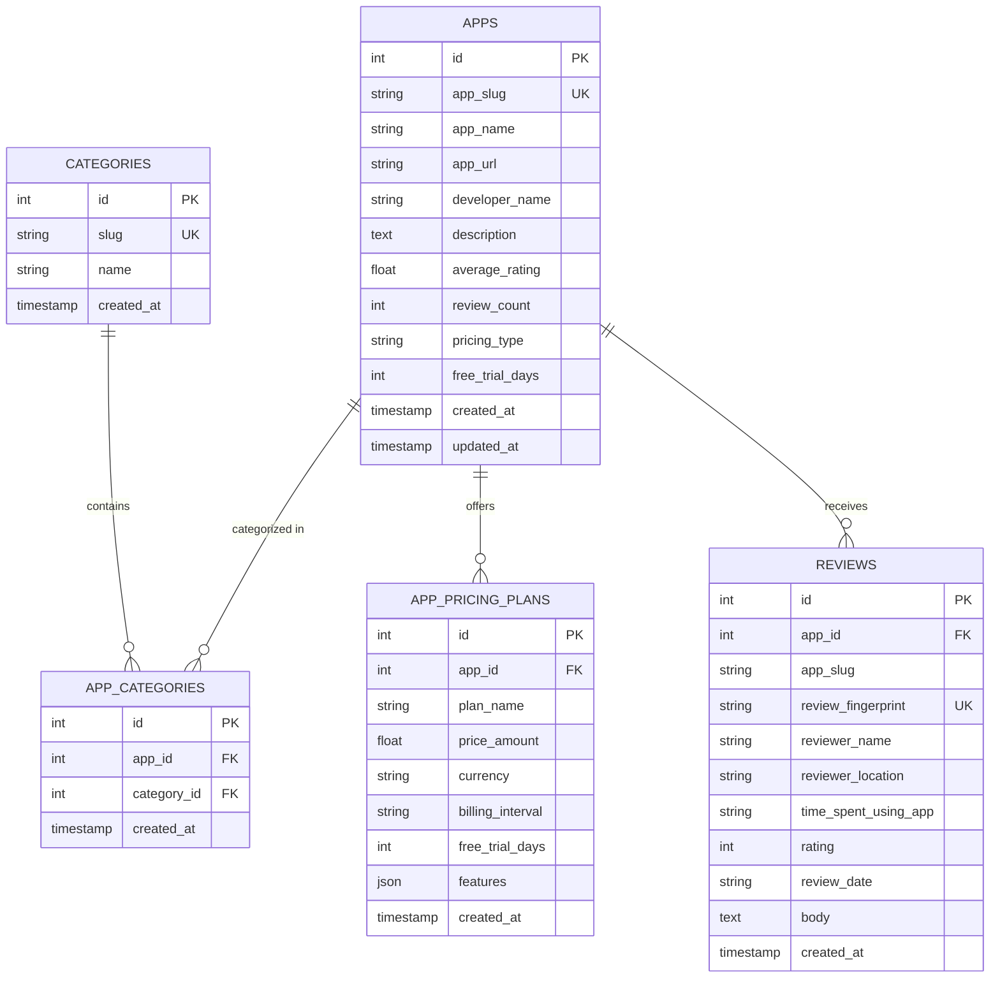

# AppScout Database Schema Reference

AppScout uses a relational **PostgreSQL** database (tested on PostgreSQL 18.6+ and compatible with serverless instances such as Neon Cloud). Object-Relational Mapping (ORM) and connection pooling are managed using **SQLAlchemy 2.0+**.

---

## 1. Entity-Relationship Diagram (ERD)

---

## 2. Table Specifications & Row Counts

### 2.1 `apps` (21,502 rows)
Stores canonical applications discovered on the Shopify App Store.

| Column | Type | Constraints | Description |
| :--- | :--- | :--- | :--- |
| `id` | `INTEGER` | `PRIMARY KEY`, Autoincrement | Internal synthetic identifier |
| `app_slug` | `VARCHAR(255)` | `UNIQUE`, `NOT NULL`, Indexed | Canonical Shopify handle (e.g. `microsoft-clarity`) |
| `app_name` | `VARCHAR(255)` | `NOT NULL` | Display title of the application |
| `app_url` | `VARCHAR(500)` | `NOT NULL` | Canonical Shopify App Store URL |
| `developer_name` | `VARCHAR(255)` | Nullable | Name of developing partner |
| `description` | `TEXT` | Nullable | Official marketplace summary |
| `average_rating` | `FLOAT` | Nullable | Public star rating (1.00 to 5.00); NULL if unreviewed |
| `review_count` | `INTEGER` | Default `0` | Total public reviews on listing; 0 if unreviewed |
| `pricing_type` | `VARCHAR(50)` | Default `'unknown'` | Classification: `free`, `freemium`, `paid`, `unknown` |
| `free_trial_days`| `INTEGER` | Nullable | Maximum trial period offered across plan tiers |
| `created_at` | `TIMESTAMPTZ`| Default `NOW()` | Timestamp record was created |
| `updated_at` | `TIMESTAMPTZ`| Default `NOW()` | Timestamp record was last modified |

### 2.2 `categories` (166 rows)
Normalized list of Shopify taxonomy categories organizing applications across the ecosystem.

| Column | Type | Constraints | Description |
| :--- | :--- | :--- | :--- |
| `id` | `INTEGER` | `PRIMARY KEY`, Autoincrement | Category identifier |
| `slug` | `VARCHAR(255)` | `UNIQUE`, `NOT NULL`, Indexed | URL slug path (e.g. `store-management-operations-analytics`) |
| `name` | `VARCHAR(255)` | `NOT NULL` | Human-readable category title |
| `created_at` | `TIMESTAMPTZ`| Default `NOW()` | Ingestion timestamp |

### 2.3 `app_categories` (32,587 rows)
Many-to-many association table linking applications to categories.

| Column | Type | Constraints | Description |
| :--- | :--- | :--- | :--- |
| `id` | `INTEGER` | `PRIMARY KEY`, Autoincrement | Record identifier |
| `app_id` | `INTEGER` | Foreign Key `apps.id` | Reference to parent app |
| `category_id` | `INTEGER` | Foreign Key `categories.id` | Reference to taxonomy category |
| `created_at` | `TIMESTAMPTZ`| Default `NOW()` | Association timestamp |

### 2.4 `app_pricing_plans` (42,326 rows)
Structured pricing plan tiers parsed from application listing pages.

| Column | Type | Constraints | Description |
| :--- | :--- | :--- | :--- |
| `id` | `INTEGER` | `PRIMARY KEY`, Autoincrement | Plan tier identifier |
| `app_id` | `INTEGER` | Foreign Key `apps.id`, Indexed | Reference to parent application |
| `plan_name` | `VARCHAR(255)` | `NOT NULL` | Title of plan (e.g. `Basic`, `Pro`, `Free`) |
| `price_amount` | `FLOAT` | Nullable | Numeric price in USD; 0.0 for free tiers |
| `currency` | `VARCHAR(10)` | Default `'USD'` | Currency symbol or code |
| `billing_interval`| `VARCHAR(50)` | Default `'month'` | Frequency: `month`, `year`, `one-time`, `usage` |
| `free_trial_days` | `INTEGER` | Nullable | Trial days specific to this tier |
| `features` | `JSON` | Nullable | List of feature strings included in tier |
| `created_at` | `TIMESTAMPTZ`| Default `NOW()` | Ingestion timestamp |

### 2.5 `reviews` (738,101 rows)
Individual verified merchant reviews extracted from Shopify review listings.

| Column | Type | Constraints | Description |
| :--- | :--- | :--- | :--- |
| `id` | `INTEGER` | `PRIMARY KEY`, Autoincrement | Review identifier |
| `app_id` | `INTEGER` | Foreign Key `apps.id`, Nullable, Indexed | Reference to application |
| `app_slug` | `VARCHAR(255)` | `NOT NULL`, Indexed | App handle for fast joins |
| `review_fingerprint` | `VARCHAR(64)` | `UNIQUE`, Indexed | Deterministic SHA-256 hash |
| `reviewer_name` | `VARCHAR(255)` | Nullable | Verified merchant store name |
| `reviewer_location` | `VARCHAR(255)` | Nullable | Merchant geographic region |
| `time_spent_using_app`| `VARCHAR(255)` | Nullable | Stated usage duration |
| `rating` | `INTEGER` | `NOT NULL`, Indexed | Star rating integer (1 to 5) |
| `review_date` | `VARCHAR(100)` | Nullable, Indexed | Published date string |
| `body` | `TEXT` | `NOT NULL` | Merchant review content |
| `created_at` | `TIMESTAMPTZ`| Default `NOW()` | Ingestion timestamp |

---

## 3. Indexing & Query Optimization

To maintain sub-100ms response times across the 738k review dataset, the following B-tree indexes are enforced:

* **`ix_reviews_fingerprint`**: `UNIQUE INDEX ("review_fingerprint")` ensures strict deduplication.
* **`ix_reviews_app_slug`**: Fast filtering when fetching reviews for individual apps.
* **`ix_reviews_rating`**: Enables instantaneous star-rating cohort aggregation.
* **`ix_reviews_review_date`**: Accelerates reverse-chronological sorting.
* **`ix_apps_app_slug`**: Single-row resolution on deep app modal requests.
* **`ix_categories_slug`**: Resolves category workspaces by handle.

---

## 4. Connection Pool Settings

Configured in [`backend/config.py`](file:///c:/Sanjana/Spryntworks/Projects/AppScout/backend/config.py) and [`experiment/db/database.py`](file:///c:/Sanjana/Spryntworks/Projects/AppScout/experiment/db/database.py):

* **Engine**: `create_engine(DATABASE_URL, pool_size=20, max_overflow=30, pool_timeout=30, pool_recycle=1800)`
* **Readiness Check**: `check_connection()` tests database readiness during application startup.
