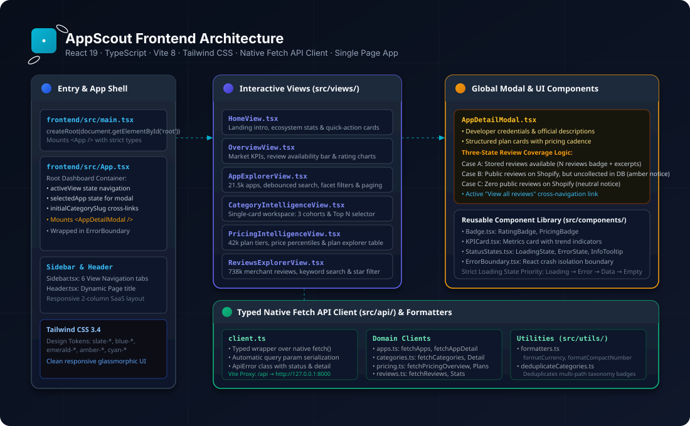

# AppScout Frontend

The **AppScout Frontend** is a modern Single Page Application (SPA) designed for eCommerce analysts, merchants, and developers to explore the Shopify App Store ecosystem.

Built with **React 19**, **TypeScript**, and **Vite 8**, it communicates asynchronously with the AppScout FastAPI backend using a strongly typed native `fetch()` client.



---

## 1. Features & Core Views

* **Home**: Introduction, key market stats, and quick navigation cards.
* **Overview**: Executive market KPIs, review availability distribution, pricing model breakdown, and star rating charts.
* **App Explorer**: Interactive directory of 21k+ applications with search, multi-facet filtering (categories, pricing, rating, trial), and pagination.
* **App Categories**: Single-card unified category workspace with app density, commercial distribution, review evidence breakdown, and ranked cohorts with Top 10/20/30/50 selector.
* **App Pricing**: Monetization intelligence across 42,326 structured plan tiers with price percentiles and searchable plan explorer table.
* **App Reviews**: Merchant review search across 738,101 reviews with star filters and merchant location tags.
* **App Detail Modal**: Global modal showing full app summaries, developer info, structured pricing cards, and merchant review excerpts.

---

## 2. Getting Started

### Prerequisites
* Node.js `20.x` or newer
* npm `10.x` or newer

### Installation
```bash
npm install
```

### Development Server
```bash
npm run dev
```
Starts the Vite dev server at [http://localhost:5173](http://localhost:5173). Requests to `/api` are automatically proxied to the backend at `http://127.0.0.1:8000`.

### Code Quality & Linting
```bash
npm run lint
```
Runs high-speed lint checks using **Oxlint**.

### Production Build
```bash
npm run build
```
Executes TypeScript type checking (`tsc -b`) and bundles production assets into `dist/`.

---

## 3. Configuration

Environment variables can be specified in `.env`:

```ini
# Optional: Set remote API endpoint if not using Vite local proxy
VITE_API_URL=http://127.0.0.1:8000/api
```

---

## 4. Documentation

For detailed frontend architecture, component specifications, and state management, see:
* [Frontend Architecture Guide](../docs/architecture/frontend-architecture.md)
* [System Architecture](../docs/architecture/system-architecture.md)
